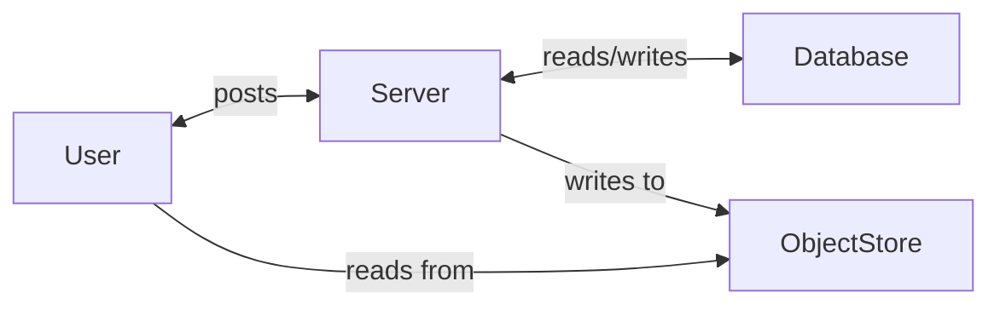
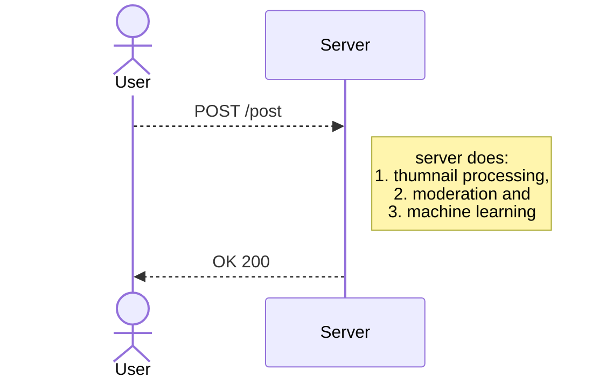
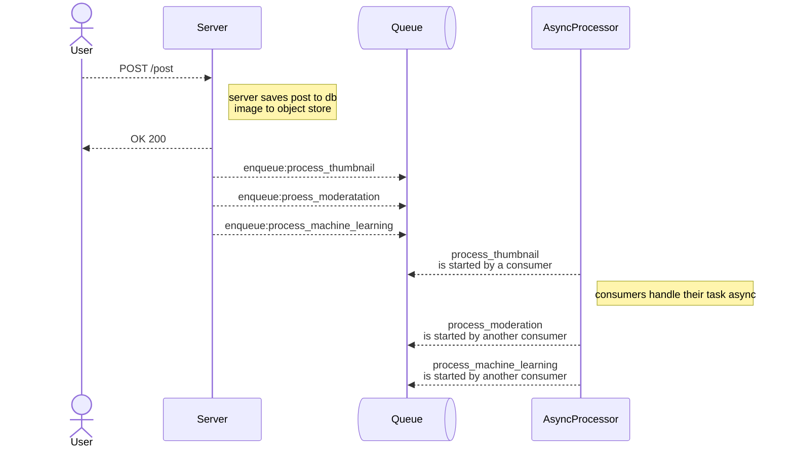
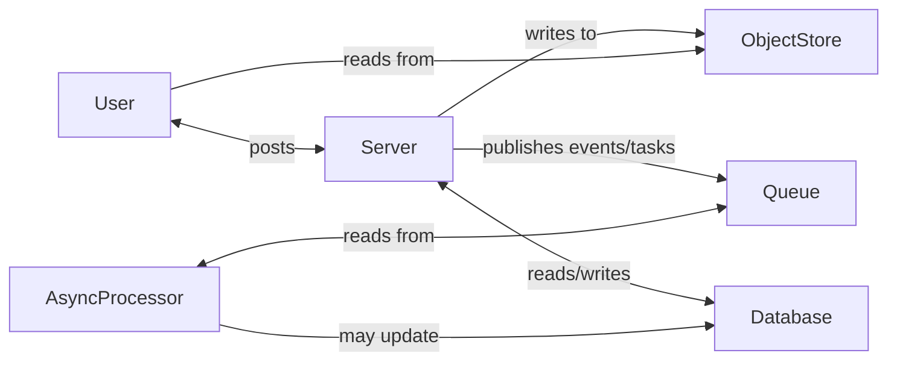

# Software Engineering Components
Today we are going to be looking at the following:

- Compute
- Database
- Object Store
- Queues
- Event Processing
- Pipelines
- Tests
- Practices

---
layout: statement
---
Let's build a very simple app!

---
layout: statement
---
An app for you and your friends to share photos with!
---
---
## Think of it like instagram lite!

You can:
- upload a photo
- your friends can upload a photo
- you all can view and like each others photos
- the app shows how many people have liked the photos
- and it can show who liked a photo
---

Ok! Let's build it.
<v-clicks>

- language
- framework
- code

</v-clicks>

<v-click>
compute - active processing and calculation done by a computer system
<br>
</v-click>

---

You may have logic in your application that the computer must enforce!

<v-clicks>

- login
- image file size
- image self like

</v-clicks>

<v-click>
    The part of code that is actively doing these logic checks and running business logic is called <strong>compute</strong>.
</v-click>

---


```python
@app.post("/login")
def login_handler(request: LoginRequest) -> UserSession:
    user = db.get_user_by_email(request.email)

    if not user:
        raise HttpException(401, {"msg":"incorrect credentials"})

    if not hash.is_same(request.password, user.password):
        raise HttpException(401, {"msg":"incorrect credentials"})

    session = get_session(user.id)

    return UserSession(session=session)
```

---

```python
def can_like_post(ctx: Context, post: Post) -> bool:
    if post.posted_by == ctx.user.id:
        return False
    return True

@POST("/posts/{id}/like")
def like_handler(context: Context, request: LikeRequest):
    post = db.get_post_by_id(request.id)
    
    if not post:
        raise HttpException(404, {"msg":"post does not exist"})
        
    if !can_like_post(context, post):
        raise HttpException(403, {"msg":"You cannot like this post"})
        
    db.like_post(post.id, context.user.id)
```
This validation, CPU bound work is an example of compute!

---
---

## What else is compute?
Anything that uses the CPU for calculation, validation, verification.
- matrix multiplication
- video rendering
- hashing
- machine learning training
- 3d game physics
 
__Basically: Math__

---
---
Our App looks like:


---
---
## Where does the data live?
Data like: ?
<v-clicks>

- who follows who
- users
- photo metadata
 
</v-clicks>

<v-click>
Oh! I know. <strong> A database </strong>
</v-click>

---
---

In Memory Database!

In `main.py` we can write:

```python
class User:
    username: str
    password: str
    email: Email[str]
    image: Optional[str]

system_users: List[User] = []
```
and every time someone registers in we can:

```python
global system_users
system_users.append(User(username="aakancha_thapa",password="329af80..", email="aakancha.thapa@gmail.com"))
```

Problem Solved!

---
---
## Why this system does not work?

<v-clicks>

- We loose everything when the process restarts
- We don't have infinite RAM!
</v-clicks>

<v-click>
So, we need some way of storing data persistently 🤔
</v-click>

<v-click>

Ideally, it should also let us 
- query data every efficiently
- allow us to update specific fields and 
- allow us to structure and map our business rules
    
</v-click>

---
layout: statement
---
# Database

---
layout: statement
---
A database is a structured, queryable, persistent state.
---
---

# Not all databases are created equally

- OLTP
- OLAP
- Time Series
- Real Time
- Key-Value stores
- Document databases
- Graph Databases
- Wide Column Databases

---
---

# Transactions and ACID

<v-clicks>

- A - Atomicity
- C - Consistency
- I - Isolation
- D - Durability
    
</v-clicks>

<v-clicks>

Transactions?

transaction is a single logical unit of work made up of one or more operations (e.g., reads, writes, updates). 

**Online Transactions Processing (OLTP) vs Online Analytics Processing (OLAP)**
</v-clicks>

---
---
Updated Diagram:


Your typical three tier architecture!


---
layout: statement
---

could we store the image bytes in the database?

---
---
<v-clicks>

No

We need another component!

What might this new component be? 🤔
</v-clicks>

---
layout: statement
---
Introducing: Object Store!

---
---
## What is an object Store?
a computer data storage approach that manages data as "blobs" or "objects".

- cheap
- durable
- built for large unstructure blobs

eg: images, videos, large JSON files, audio files, csv files from machine learning, backups

---
layout: statement
---
Different data has different shapes and shape determines where it lives.

---
---
Updated Diagram:

Out system keeps getting more and more complicated:0

---
layout: statement
---
Your friends complain that uploads are getting too slow:(

---
---
This is happening because when a post is made, we are also:

- generating thumbnails and resizing images for various screens
- moderation check (18+, flash warning)
- machine learning categorization


---
layout: statement
---
Should the user's request block on all of that?


---
layout: statement
---
Introducing: Queue!

---
---
Because our tasks don't require for us to be waiting for it in real time.

Its ok for them to be done a little while after our request has been handeled. We can schedule them seperately using a queue.

Let's look at this example:

```python
def handle_post_upload(post_upload_request: PostUploadRequest):
    saved = save_to_db(post_upload_request.post) # blocking
    
    thumbnail_queue.enqueue(post_upload_request.images) # does not block
    moderation_queue.enqueue(post_upload_request.post) # does not block
    machine_learning_queue.enqueue(post_upload_request.post) # does not block
    
    return saved
```
---
---
## We need to learn to differentiate what tasks have to be done in real time and need strict consistency and what tasks can be scheduled in the background.

---
---
Our problem:



---
---
<!--The Solution:-->



---
---
Small test:

<v-clicks>

- email sending: send welcome emails, password resets, sms alsers and push notifications?
- file and media processing: resizing photos, converting video formats, scanning for viruses?
- updating a user record, PATCH /user with new email
- updating a db record?

</v-clicks>

<v-click>

These types of events are called
# Fire and Forget
</v-click>

---
layout: statement
---

The PubSub pattern

---
---
Our Diagram


---
layout: quote
---
"I learned from the Gmail team... when users started entering their usernames on Gmail, the system would begin preparing their account in the background—even before they entered their password... We applied this concept to photo uploads. We realized that by the time you're done typing a witty caption and you hit 'Share', the upload is already 90% done."

-Kevin Systorm (CTO, Instagram)

---
layout: statement
---
Instagram's early success was driven by asynchronous processing, utilizing background uploads and decoupled worker queues to eliminate user-facing friction. By offloading heavy tasks like photo processing and notifications to tools such as Celery, the platform ensured an instantaneous user experience.


---
---

# Batching

<v-clicks>

- Amortizes fixed overhead — spreads connection, auth, and serialization costs across many items instead of paying them per-message
- Leverages provider bulk APIs — push/SMS/email gateways are rate-limited per call, not per item; batching maximizes throughput within those limits
- Reduces DB/queue load — bulk inserts and batched produce/consume calls cut transaction and broker overhead dramatically vs. row-by-row operations
- Trades latency for throughput — fire-and-forget has no user waiting on a single response, so a small buffering delay is "free" and unlocks major scale gains
- Enables backpressure control — batch size becomes a tuning knob to protect downstream systems during load spikes or provider errors

</v-clicks>

---
---
# So many components!
Seesh! We just added so much complexity to our system, now the most difficult part in software engineering.

## How to manage changes and project growth?

<v-clicks>

- tests: types?
- test coverage % guard
- style guide
- syntax formatting guide
- CI/CD pipelines
</v-clicks>

---
---
Assignment!

---
---

Day 2: Component(Compute)

Day 3: Component(Database)

Day 4: How these Components() communicate with each other

Day 5: How to deploy these components and kept running

---
layout: quote
---
any sufficiently advanced technology is indistinguishable from magic

-arthur c. clarke
