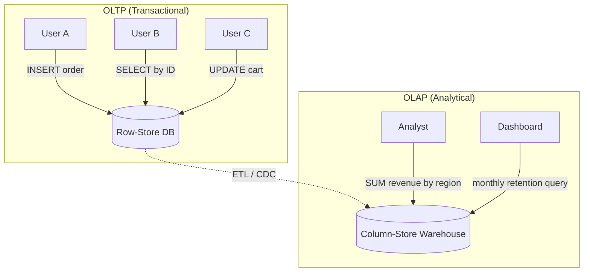
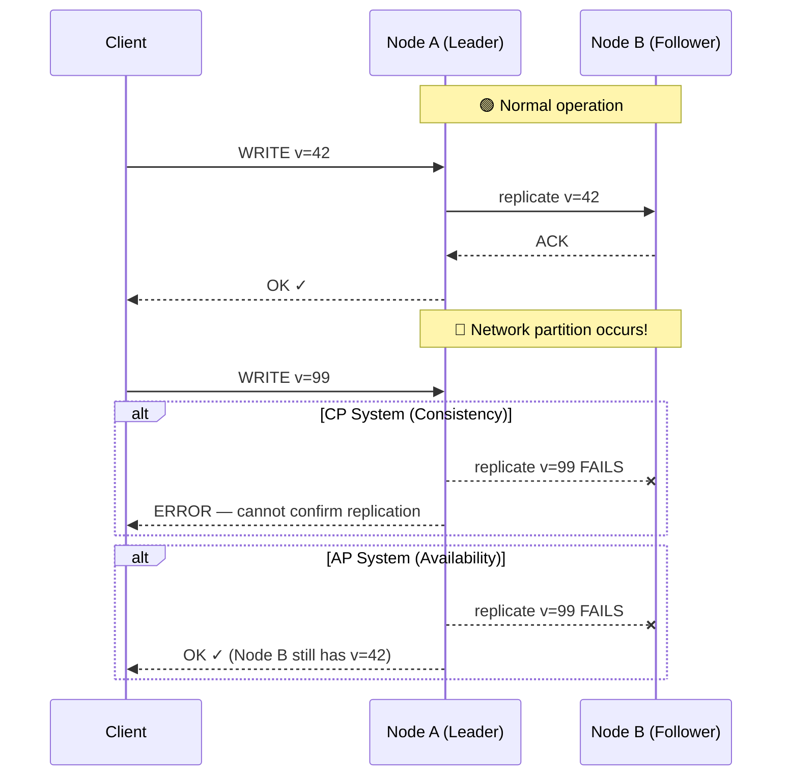
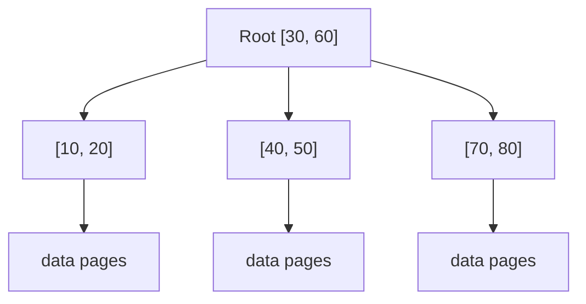
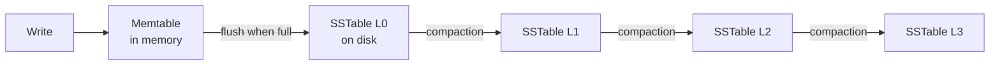
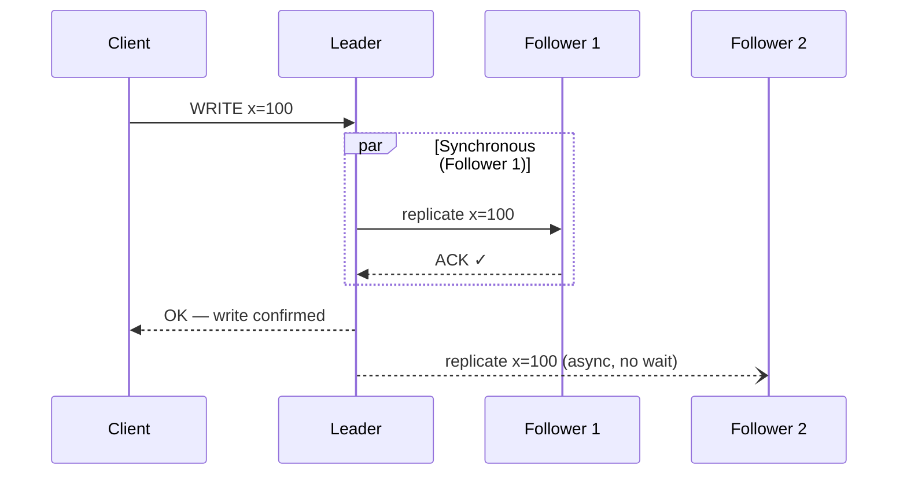
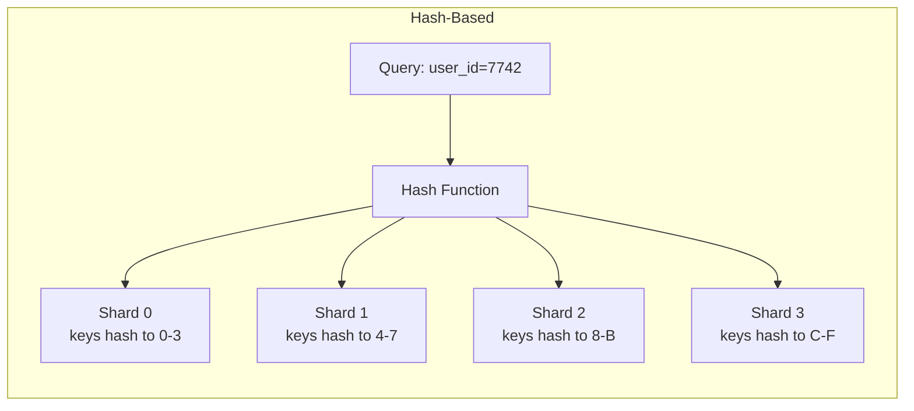

---
---
# Day 3 — Deep Dive into Databases

---
layout: statement
---

You're building a payment system. A user transfers $500. Your database confirms the write. Then the network between your two database nodes goes down.

**One node says the balance is $500. The other says it's $1,000.**

Which one is right? And what should your system do next?

<!-- Every design decision we cover today — OLTP vs OLAP, storage engines, replication, sharding — traces back to this kind of tradeoff. By the end of this session, you'll have the vocabulary and mental models to reason through it. -->

---
layout: statement
---

# OLTP vs OLAP

Two fundamentally different workloads. Two fundamentally different architectures.

---
---

# OLTP — Online Transaction Processing

Optimized for **many small reads and writes** that touch a few rows at a time.

<v-clicks>

- **Pattern:** `INSERT INTO orders ...`, `SELECT * FROM users WHERE id = 42`
- **Latency goal:** milliseconds
- **Concurrency:** thousands of clients doing independent operations
- **Examples:** user sign-ups, placing orders, updating a shopping cart, recording a bank transfer

</v-clicks>

<!-- OLTP is what most of you have been writing against — Postgres, MySQL, etc. The key thing is: each query touches a tiny slice of the data, and speed per-query matters enormously. -->

---
---

# OLAP — Online Analytical Processing

Optimized for **large aggregation queries** that scan millions or billions of rows.

<v-clicks>

- **Pattern:** `SELECT region, SUM(revenue) FROM sales GROUP BY region WHERE year = 2025`
- **Latency goal:** seconds to minutes (acceptable)
- **Concurrency:** a handful of analysts or scheduled batch jobs
- **Examples:** monthly revenue reports, user retention cohort analysis, ML feature extraction pipelines

</v-clicks>

<!-- The key difference: OLAP doesn't care about single-row latency. It cares about throughput over huge datasets. Nobody is clicking a button waiting for this query — it's a report that runs overnight or on a dashboard that refreshes every 15 minutes. -->

---
---

# Why the performance difference? Storage layout.

<v-clicks>

**Row-oriented storage** (OLTP): stores all columns of a row together on disk.
- Great when you need the full row: `SELECT * FROM users WHERE id = 42`
- Terrible when you need one column across millions of rows

**Column-oriented storage** (OLAP): stores all values of a single column together.
- Terrible for fetching a full row (must reconstruct from many column files)
- Excellent for `SUM(revenue)` — reads only the revenue column, skips everything else
- Enables massive compression (similar values stored together)

</v-clicks>

<!-- This isn't an arbitrary design choice — it's physics. Disk reads are sequential. If you need one column from a billion rows, reading only that column's contiguous bytes is orders of magnitude faster than reading a billion full rows and throwing away 95% of the data. -->

---
layout: statement
---

<!-- In most real systems, you have BOTH. The OLTP database handles live traffic. Periodically, data is extracted and loaded into a separate OLAP warehouse for analysis. This separation exists because the two workloads would destroy each other's performance if run on the same system. -->

---
layout: statement
---

# The CAP Theorem

What every distributed database must choose — and why.

---
---

# CAP Theorem — The three properties

<v-clicks>

**Consistency (C):** Every read receives the most recent write or an error. All nodes see the same data at the same time.

**Availability (A):** Every request receives a non-error response — but the response may not contain the most recent write.

**Partition Tolerance (P):** The system continues to operate despite network partitions (messages lost or delayed between nodes).

</v-clicks>

<v-click>

The theorem states: **you can guarantee at most two of three.**

</v-click>

<!-- These sound like three equal choices, but they're not. Let's see why. -->

---
---

# Partition tolerance isn't optional

In any system that runs on more than one machine, network partitions **will happen**.

<v-clicks>

- Switches fail. Cables get cut. Cloud availability zones lose connectivity.
- You cannot choose "I don't want partitions" — you can only choose what to do **when** one occurs.
- This means the real choice is: **during a partition, do you sacrifice C or A?**

</v-clicks>

<v-click>

| During a partition... | CP System | AP System |
|---|---|---|
| A client writes data | Rejects the write (or blocks) | Accepts the write locally |
| A client reads data | May return error or block | Returns data (possibly stale) |
| After partition heals | Nodes are consistent | Nodes must reconcile conflicts |

</v-click>

<!-- This is the key insight: CAP is not "pick 2 of 3." It's "when a partition happens, do you choose consistency or availability?" When there's no partition, you can have both. -->

---
layout: statement
---

<!-- # CAP — Network partition scenario -->

<!-- Walk through this diagram carefully. The top half is the happy path — both systems behave identically. The bottom half is where they diverge. CP says "I'd rather fail than lie." AP says "I'd rather serve stale data than be unavailable." -->

---
---

# Try it — Interactive CAP Simulator

<CapSimulator />

<!-- Let them play with this for a minute. Toggle the partition, try writing with each strategy. Ask: "When would you want the CP behavior? When would you want AP?" -->

---
layout: statement
---

# DB Engines: B-tree vs LSM tree

The data structures that power your reads and writes.

---
---

# B-tree — The classic

The default index structure in PostgreSQL, MySQL (InnoDB), SQLite, and most traditional databases.

<v-clicks>

- **Structure:** Balanced tree with sorted keys. Each node is a fixed-size page (typically 4–16 KB).
- **Writes:** Find the page containing the key → update it **in place** on disk.
- **Reads:** Walk the tree from root to leaf — O(log n) page reads.
- **Strength:** Predictable read latency. Great for read-heavy OLTP.
- **Weakness:** Each write is a random disk I/O (updating a page in place). Write amplification from page splits.

</v-clicks>

<!-- B-trees have been the workhorse of databases for 50 years because reads are fast and predictable. But that in-place update model has a cost — every write must locate and modify a specific disk page. -->

---
---

# B-tree structure

<v-clicks>

- Tree is **balanced** — every leaf is the same depth
- Lookup: start at root, binary search within each node, follow pointer down
- Typical B-tree with branching factor 500 and 4 levels can index **billions** of keys

</v-clicks>

<!-- This is simplified — real B-trees have hundreds of keys per node, not two. The point is: reads are logarithmic in the number of keys, and you rarely need more than 3-4 disk reads to find any key. -->

---
---

# LSM tree — Optimized for writes

Used by LevelDB, RocksDB, Cassandra, ScyllaDB, and most write-heavy systems.

<v-clicks>

- **Structure:** Writes go to an in-memory buffer (memtable). When full, flushed to disk as an immutable sorted file (SSTable).
- **Writes:** Always sequential appends — never modify existing files. Extremely fast.
- **Reads:** Must check memtable, then search through multiple SSTables (mitigated by bloom filters).
- **Compaction:** Background process merges SSTables to reclaim space and reduce read overhead.
- **Strength:** Massive write throughput. Great for time-series, logging, event streams.
- **Weakness:** Read amplification (checking multiple levels). Compaction uses CPU and disk bandwidth.

</v-clicks>

<!-- The key insight: LSM trees trade read performance for write performance. Instead of expensive random writes to update pages in place, every write is a cheap sequential append. The cost comes later during compaction and during reads that must search multiple files. -->

---
---

# LSM tree — Write path

<v-clicks>

- **Memtable:** sorted in-memory tree (red-black tree or skip list)
- **Flush:** memtable → immutable SSTable file on disk (sequential write)
- **Compaction:** merge overlapping SSTables, discard deleted keys, produce larger sorted runs

</v-clicks>

---
---

# When to use which?

| | B-tree | LSM tree |
|---|---|---|
| **Best for** | Read-heavy OLTP | Write-heavy workloads |
| **Write pattern** | In-place update (random I/O) | Sequential append |
| **Read pattern** | Single tree walk | Check multiple levels |
| **Use cases** | Postgres, MySQL, banking | Cassandra, time-series, logging |
| **Write throughput** | Lower | Higher |
| **Read latency** | Lower, predictable | Higher, variable |
| **Space overhead** | Pages may be partially full | Temporary duplication before compaction |

<!-- This is one of those tables worth actually internalizing. When someone says "we're using Cassandra for our banking ledger," you should immediately feel uncomfortable — and now you know why. -->

---
---
btree.app

saiprakash.in/lsm

---
layout: statement
---

# Replication

Copying data across multiple nodes — and why it's harder than it sounds.

---
---

# Why replicate?

<v-clicks>

**Durability:** If one machine's disk dies, data survives on another.

**Availability:** If one node goes down, others can serve requests.

**Read scaling:** Spread read load across multiple replicas.

</v-clicks>

<v-click>

Three main replication topologies:

1. **Single-leader:** One node accepts writes, replicates to followers
2. **Multi-leader:** Multiple nodes accept writes, replicate to each other (complex conflict resolution)
3. **Leaderless:** Any node accepts writes, quorum-based consistency (Dynamo-style)

</v-click>

<!-- For this course, single-leader is the one you need to deeply understand — it's what Postgres, MySQL, and most systems you'll work with use. Multi-leader and leaderless exist for specific use cases (geo-distributed writes, extreme availability requirements). -->

---
layout: statement
---

<!-- # Synchronous vs asynchronous replication -->

---
---

<v-clicks>

**Synchronous:** Leader waits for follower ACK before confirming to client. Guarantees consistency but adds latency.

**Asynchronous:** Leader confirms immediately, replicates in background. Lower latency, but follower may lag (replication lag → stale reads).

</v-clicks>

<!-- Most real systems use semi-synchronous: one synchronous follower (guarantees at least one replica is up to date) and the rest async. Pure synchronous to all replicas is too slow. Pure async risks data loss if the leader crashes before replication. -->

---
layout: statement
---

# Sharding (Partitioning)

When one machine can't hold all your data — or handle all your load.

---
---

# Why shard?

<v-clicks>

- Your dataset exceeds the storage capacity of a single machine
- Your write throughput exceeds what a single machine can handle
- You want to parallelize queries across independent subsets of data

</v-clicks>

<v-click>

**Key idea:** Split data into **partitions (shards)**, each owned by a different node. Each shard is a fully independent slice of the data.

</v-click>

<!-- Sharding is conceptually simple — "split the data up" — but operationally it's one of the hardest things in distributed systems. The devil is in the details of how you split, how you route queries, and what happens when you need to change the split. -->

---
---

# Sharding strategies

---
---

https://planetscale.com/blog/database-sharding

---
---

<v-clicks>

**Key-range partitioning:** Shard A gets users A–M, Shard B gets N–Z. Simple, supports range queries, but prone to hot spots.

**Hash-based partitioning:** Hash the key, assign to shard by hash range. Even distribution, but range queries require scatter-gather across all shards.

</v-clicks>

<!-- The rebalancing problem: when you add or remove a shard, you have to move data around. Naive hash partitioning (mod N) is a disaster here because changing N reshuffles almost everything. Consistent hashing solves this by minimizing data movement. -->

---
---

# The rebalancing problem

<v-clicks>

When you add a new shard, data must move. How much?

**Naive approach:** `shard = hash(key) % num_shards` — changing `num_shards` reshuffles nearly **all** keys. Catastrophic.

**Consistent hashing:** Map both keys and nodes to a ring. Adding a node only steals keys from its neighbors. Minimal data movement.

This is why production systems use consistent hashing or fixed partition counts with reassignment (e.g., Kafka partition assignment).

</v-clicks>

<!-- You don't need to implement consistent hashing. You need to know that naive mod-N hashing is a trap and that smarter rebalancing strategies exist. This comes up in every system design interview. -->

---
layout: statement
---

# Case Studies
Putting it all together through the CAP lens.

---
---

# Case Study 1: Banking Ledger 

<v-clicks>

**System:** A bank's core ledger recording account balances and transfers.

**CAP choice:** CP — prioritize consistency over availability.

**Why:** If a $500 transfer is recorded on one node but not another, a customer could spend the same money twice. Financial correctness is a legal and business requirement — the cost of inconsistency is **real money lost.**

**What it sacrifices:** During a network partition, the system may reject transactions or become temporarily unavailable. Users see "service temporarily unavailable" instead of incorrect balances.

**Storage engine:** B-tree (read-heavy, needs ACID transactions with predictable latency).

**This is the correct tradeoff.** Banks would rather be temporarily down than silently wrong.

</v-clicks>

<!-- Connect this back to the opening scenario. The bank chooses: "if I can't confirm the write was replicated, I reject it." That's CP behavior. The customer is frustrated for 30 seconds. But nobody loses money. -->

---
---

# Case Study 2: Social Media Like Counter

<v-clicks>

**System:** The like count displayed on a social media post.

**CAP choice:** AP — prioritize availability over consistency.

**Why:** If a post shows 4,021 likes on one server and 4,023 on another, nobody notices or cares. But if the like button doesn't respond, users think the app is broken.

**What it tolerates:** Stale reads. Different users may see slightly different like counts for a few seconds. Eventually, replicas converge.

**Storage engine:** LSM-tree backed store (extremely write-heavy — millions of like events per second across the platform).

**This is the correct tradeoff.** A like counter that's 2 seconds behind is invisible to users. A like button that errors out is a bug report.

</v-clicks>

<!-- This is the payoff for the CAP section. Not every system needs the same guarantees. The skill is recognizing which tradeoff matches which domain. A like counter with CP behavior would be absurdly over-engineered. A banking ledger with AP behavior would be negligent. -->

---
---

# Recap — The shape of your data determines everything

<v-clicks>

- **OLTP vs OLAP:** Are you serving live user transactions or running batch analytics? This determines your storage layout and query engine.
- **CAP theorem:** During a network partition, do you need correctness or responsiveness? This determines your replication strategy.
- **B-tree vs LSM tree:** Is your workload read-heavy or write-heavy? This determines your storage engine.
- **Replication:** How durable and available do you need to be? This determines sync vs async and your topology.
- **Sharding:** How much data and load? This determines whether and how you partition.

</v-clicks>

<v-click>

**One sentence:** Your tolerance for staleness and your data's access pattern determine every infrastructure choice.

</v-click>

---
---

# Assignment: "Pick Your Tradeoff"

For each of the following three scenarios, decide: **should the system prioritize consistency or availability?** Justify your answer in 1–2 sentences.

