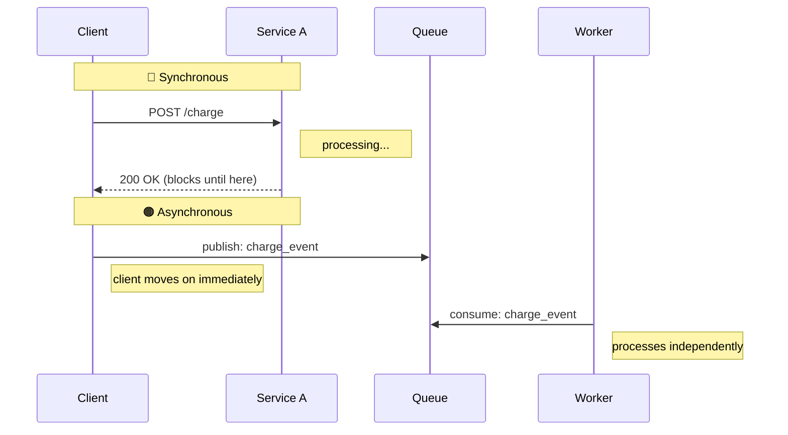
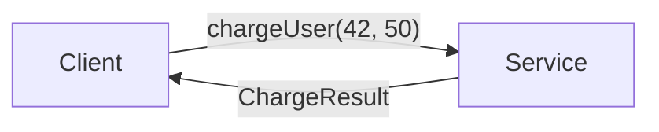
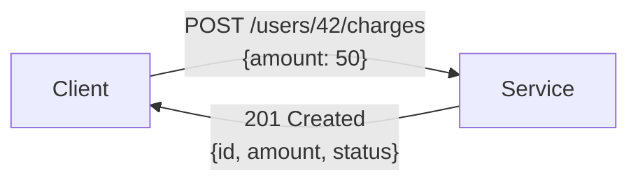
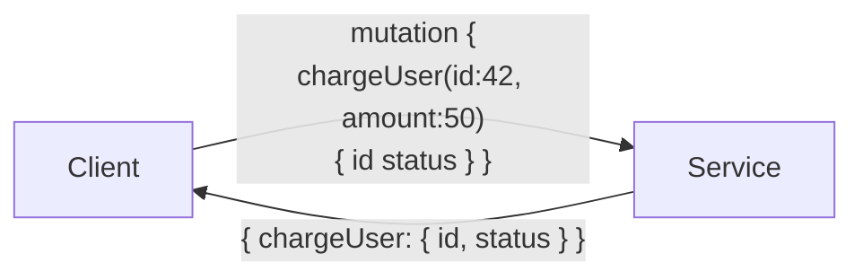
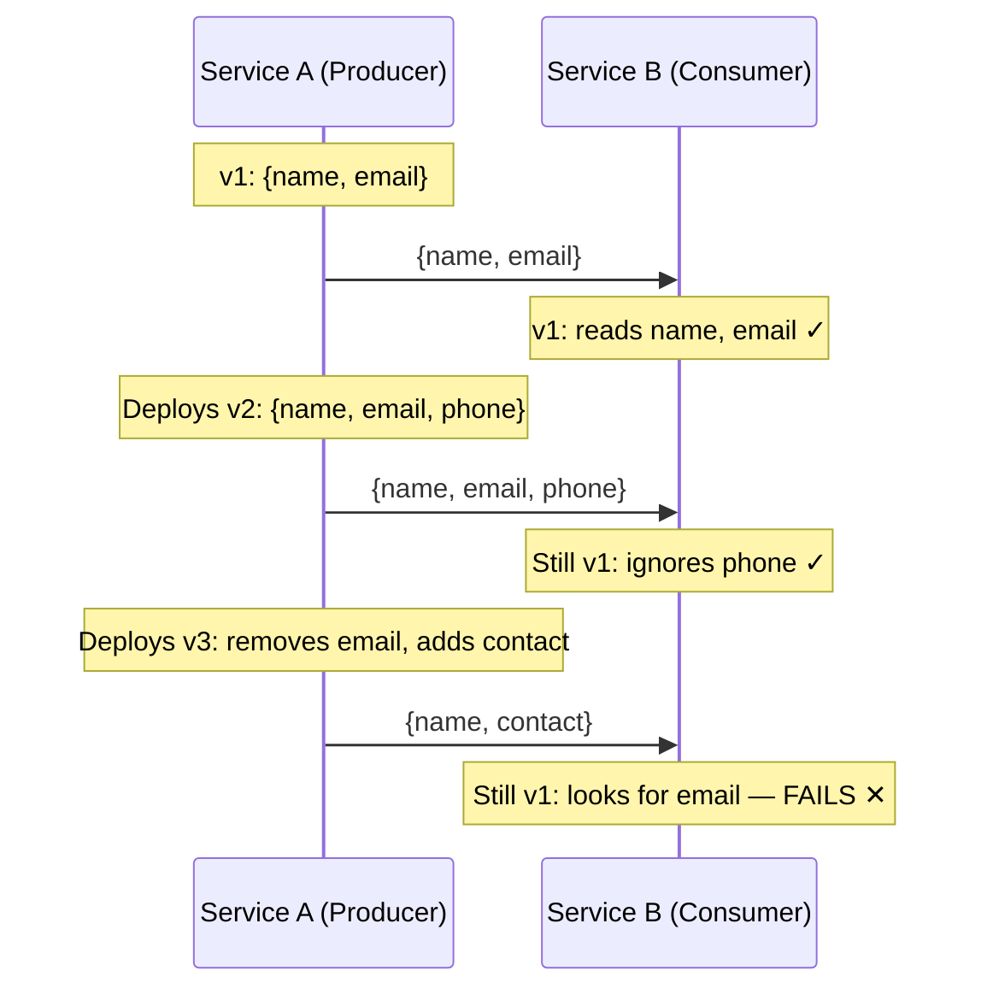
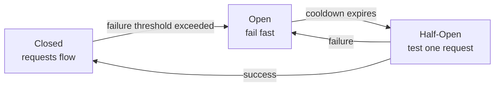
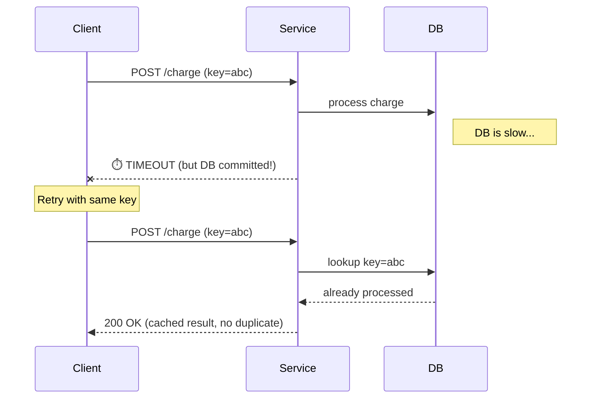

---
---
# Day 4 — Deep Dive into Service Communication

---
layout: statement
---

A user clicks "Pay $50." The request times out. Your client retries. The server had actually processed the first request — it just couldn't respond in time.

**The user is now charged $100.**

How did we get here, and how do we make sure it never happens?

<!-- This exact scenario is the throughline for today's entire session. By the end, you'll understand why it happens, what primitives prevent it, and how real systems deal with it. We'll come full circle back to this. -->

---
layout: statement
---

# Synchronous vs Asynchronous Communication

The two fundamental modes of service-to-service interaction.

---
---

# Synchronous communication

The caller sends a request and **blocks until it gets a response**.

<v-clicks>

- The caller cannot proceed until the downstream service responds (or the call times out)
- This is the model you're most familiar with: HTTP request → wait → HTTP response
- Simple to reason about: you know the result before moving on
- **Problem:** If the downstream service is slow, the caller is stuck waiting — burning a thread/connection the whole time

</v-clicks>

<!-- Think of sync like a phone call: you dial, the other side picks up, you talk, you hang up. You're fully committed for the entire duration. -->

---
---

# Asynchronous communication

The caller sends a message and **does not wait for a response**. The result (if any) arrives later via a different channel.

<v-clicks>

- The caller drops a message onto a queue or event bus and moves on immediately
- A consumer picks up the message later and processes it independently
- **Advantage:** Caller and consumer are decoupled in time — the consumer can be slow, down, or even not deployed yet
- **Advantage:** Natural backpressure — the queue buffers load spikes

</v-clicks>

<v-click>

You already met this on **Day 1** — the queue pattern for thumbnail processing, moderation, and ML tasks. Today we focus on how the **synchronous** side works, and the reliability problems it introduces.

</v-click>

<!-- Async is like sending an email: you hit send and move on. You don't sit there staring at your inbox. The recipient processes it whenever they can. -->

---
---

# Sync vs Async — Side by side



<!-- The key difference: in sync, the client's fate is tied to the service's response time. In async, they're fully decoupled. Most real systems use BOTH — sync for things that need an immediate answer (like "did my login succeed?"), async for things that don't (like "send a confirmation email"). -->

---
layout: statement
---

# RPC vs REST vs GraphQL

Three styles of synchronous communication — different tradeoffs for different contexts.

---
---

# RPC — Remote Procedure Call

Calling a remote function **as if it were local**.

<v-clicks>

- You define a function signature (e.g., `chargeUser(userId, amount)`) and call it across the network
- The framework handles serialization, transport, deserialization
- **Tight coupling:** caller must know the exact method name and parameter types
- **Efficient:** binary serialization (Protobuf), HTTP/2 multiplexing (gRPC), low overhead
- **Best for:** internal service-to-service calls where both sides are owned by the same team

</v-clicks>

<!-- gRPC is the dominant RPC framework today. It generates client and server code from a .proto file, so both sides agree on the contract at compile time. Very fast, very rigid. -->

---
---

# REST — Representational State Transfer

Modeling your API as **resources** operated on by HTTP verbs.

<v-clicks>

- Resources have URLs: `/users/42`, `/users/42/orders`
- HTTP verbs map to operations: `GET` (read), `POST` (create), `PUT` (update), `DELETE` (remove)
- **Loose coupling:** clients only need to know URLs and HTTP — no generated code required
- **Over-fetching:** `GET /users/42` returns the whole user object even if you only need the name
- **Under-fetching:** getting a user + their orders = two separate HTTP requests
- **Best for:** public-facing APIs, third-party integrations, when flexibility matters more than performance

</v-clicks>

<!-- REST is the default choice for most web APIs because every language has an HTTP client. The tradeoff is that it's less efficient than RPC and you often end up making more round trips than you'd like. -->

---
---

# GraphQL — Client-driven queries

The client specifies **exactly** what data it needs in a single request.

<v-clicks>

- One endpoint, flexible queries: `{ user(id: 42) { name, orders { total } } }`
- **Solves over-fetching:** only returns the fields you asked for
- **Solves under-fetching:** nested data in one round trip
- **Tradeoff:** shifts complexity to the server (query parsing, authorization per field, N+1 query problems)
- **Best for:** clients with highly varied data needs — mobile apps, dashboards with many widgets

</v-clicks>

<!-- GraphQL is not "better REST." It's a different tradeoff. The server becomes more complex because it has to handle arbitrary query shapes. But for clients that need flexibility (especially mobile, where bandwidth and round trips are expensive), it can be a huge win. -->

---
layout: statement
---

# The same request, three ways
---
---

RPC



---
---

REST


---
---
GraphQL


<!-- All three accomplish the same thing — call a remote service to charge a user. The difference is in coupling, flexibility, and efficiency. None is universally "best." -->

---
---

# When to reach for what

| | RPC (gRPC) | REST | GraphQL |
|---|---|---|---|
| **Coupling** | Tight (shared proto) | Loose (HTTP/URLs) | Medium (shared schema) |
| **Performance** | Highest (binary, HTTP/2) | Moderate (JSON, HTTP/1.1) | Varies (query complexity) |
| **Flexibility** | Low (fixed methods) | Moderate | High (client-driven) |
| **Best for** | Internal service-to-service | Public APIs, third-party | Mobile, varied client needs |
| **Schema** | Enforced (Protobuf) | Convention (OpenAPI) | Enforced (SDL) |

<v-click>

**Rule of thumb:** gRPC between your own services, REST for external APIs, GraphQL when clients need flexible data access.

</v-click>

<!-- This is intentionally opinionated. In practice, many companies use REST everywhere and it works fine. But if you're designing a new internal system with 50 services calling each other, gRPC's type safety and performance matter. -->

---
layout: statement
---

# Serialization & Schema

How data travels between services — and why the format matters more than you think.

---
---

# What is serialization?

<v-clicks>

**Serialization:** converting an in-memory data structure (object, struct) into a byte stream that can be sent over the network or written to disk.

**Deserialization:** the reverse — bytes back into a usable data structure.

Every time Service A talks to Service B, this happens:

</v-clicks>

<v-click>

```
Service A                          Service B
[User object] → serialize → [bytes over network] → deserialize → [User object]
```

</v-click>

<v-click>

The format you choose for those bytes has real consequences.

</v-click>

<!-- This sounds obvious, but the serialization format affects payload size, parsing speed, and whether you can evolve your data structures without breaking consumers. -->

---
---

# JSON vs binary formats (Protobuf, Avro)

| | JSON | Protobuf / Avro |
|---|---|---|
| **Readability** | Human-readable text | Binary (not readable) |
| **Schema** | None enforced | Strictly enforced |
| **Payload size** | Larger (field names repeated) | Compact (field tags, no names) |
| **Parse speed** | Slower (string parsing) | Faster (binary decoding) |
| **Flexibility** | Add any field anytime | Must define schema first |
| **Debugging** | Easy (just print it) | Needs tooling to inspect |


---
---

<v-click>

**The core tradeoff:** JSON gives you flexibility and readability. Binary formats give you performance and correctness guarantees.

Internal high-throughput services → Protobuf. Public APIs and debugging → JSON.

</v-click>

<!-- At small scale, JSON is fine for everything. At scale — thousands of requests per second, hundreds of services — the overhead of JSON parsing and the lack of schema enforcement become real problems. A misspelled field name in JSON silently produces wrong behavior. A missing field in Protobuf is a compile error. -->

---
layout: statement
---

# Schema Evolution

What happens when Service A updates its data format but Service B hasn't been redeployed yet.

---
---

# Why schema evolution matters

In production, services deploy **independently**. Service A may ship a new version with an updated schema while Service B is still running last week's code.

<v-clicks>

- If the new schema is **backward compatible**, old consumers can still read new data (they ignore unknown fields)
- If the new schema is **forward compatible**, old producers' data can still be read by new consumers (new fields have defaults)
- If you **rename or remove** a field, old consumers break — they're looking for a field that no longer exists

</v-clicks>

<v-click>

**Safe changes:** adding a new optional field with a default value.

**Unsafe changes:** removing a field, renaming a field, changing a field's type.

</v-click>

<!-- This is why Protobuf uses numeric field tags instead of names. You can add field 7, and services that don't know about field 7 simply skip it. But if you reuse or delete a tag number, everything breaks. -->

---
layout: statement
---

<!-- # Schema drift between services -->



<!-- The first evolution (adding phone) is safe — backward compatible. The second (removing email) is breaking. This is why schema registries exist in production Kafka setups — they reject schema changes that would break existing consumers. -->

---
layout: statement
---

# Reliability Primitives

Idempotency, retries, timeouts, backpressure, and circuit breakers — the toolkit for surviving network failures.

---
---

# Retries — necessary but dangerous

Networks fail transiently. A request that fails once may succeed if you try again.

<v-clicks>

- Connection resets, DNS hiccups, momentary server overload — all transient
- **Without retries:** a single dropped packet = a failed operation for the user
- **With naive retries:** you might re-execute an operation that actually succeeded (the server processed it, but the response was lost)

</v-clicks>

<v-click>

This is exactly the opening scenario: the payment went through, the timeout fired, the client retried, and the user was charged twice.

</v-click>

<!-- Retries are a must. But retries without idempotency are a bug. The combination is what makes a system reliable. -->

---
---

# Idempotency — the safety net for retries

An operation is **idempotent** if performing it multiple times produces the same result as performing it once.

<v-clicks>

- `GET /users/42` — naturally idempotent (reading doesn't change state)
- `DELETE /users/42` — idempotent (deleting twice = same result: user is gone)
- `POST /payments {amount: 50}` — **NOT** idempotent (each call creates a new payment!)

</v-clicks>

<v-click>

**The fix:** attach a unique **idempotency key** to each logical operation. The server checks: "have I seen this key before? If yes, return the cached result instead of re-processing."

```
POST /payments
Idempotency-Key: pay_abc123
{amount: 50}
```

Server: "I've already processed `pay_abc123` → return cached 200 OK, do not charge again."

</v-click>

<!-- Stripe, PayPal, and every serious payment API supports idempotency keys. It's not optional — it's a correctness requirement for any non-idempotent operation that might be retried. -->

---
---

# Try it — Interactive Idempotency Simulator

<IdempotencySimulator />

<!-- Let them click "Charge $50" a few times with idempotency OFF — watch the duplicate charges pile up. Then toggle it ON and try again. The "Actual Charges" counter should stay in sync with "Intended Payments" only when idempotency is on. Ask: "Which version would you want running your bank account?" -->

---
---

# Timeouts — every network call needs one

What happens when a downstream service doesn't respond?

<v-clicks>

- Without a timeout, your thread/connection waits **forever** — holding memory, connections, and eventually exhausting your server's resources
- Other requests start queuing behind the stuck one → cascading slowness
- **Rule:** every network call must have a timeout. No exceptions.

</v-clicks>

<v-click>

**Choosing a timeout value is a tradeoff:**

- Too short → you time out on requests that would have succeeded (false failures)
- Too long → you hold resources for too long during actual failures (wasted capacity)

Most services use p99 latency × 2–3 as a starting point.

</v-click>

<!-- A missing timeout is one of the most common causes of cascading failures in production. Service A calls Service B which is slow, Service A's threads fill up, Service A becomes slow, everything calling Service A becomes slow. One slow service takes down the whole system. -->

---
---

# Backpressure — don't drown your downstream

When a service can't keep up with incoming load:

<v-clicks>

- **Without backpressure:** requests pile up in memory, the service OOMs and crashes, or it responds so slowly that callers time out and retry — making the overload **worse**
- **With backpressure:** the overloaded service signals "I'm full" — rejects new requests with 429 (Too Many Requests) or 503 (Service Unavailable)
- The caller can then back off, retry later, or shed load

</v-clicks>

<v-click>

**The insight:** blindly retrying against an overloaded service is like honking in a traffic jam — it makes everything worse.

</v-click>

<!-- Backpressure is the system's immune response to overload. Without it, a spike in load becomes a cascading failure. With it, the system degrades gracefully — some requests fail fast, but the system recovers. -->

---
---

# Circuit breakers — stop hammering a dead service

<v-clicks>

A circuit breaker tracks the failure rate of calls to a downstream service:

- **Closed (normal):** requests flow through. Failures are counted.
- **Open (tripped):** too many failures → stop sending requests entirely. Return errors immediately without calling the downstream service. (Fails fast instead of timing out.)
- **Half-open (testing):** after a cooldown period, let one request through. If it succeeds, close the circuit. If it fails, re-open.

</v-clicks>

<v-click>



</v-click>

<!-- The circuit breaker pattern exists because a service that's down will stay down whether you send it 1 request or 10,000. All those extra requests are wasted work that makes recovery harder. Fail fast, give the downstream time to recover. Netflix's Hystrix popularized this pattern. -->


---
layout: statement
---


<!-- # How these primitives work together -->



---
---

<v-click>

**Timeout** told the client something was wrong. **Retry** gave it a second chance. **Idempotency** prevented the duplicate. All three are required — any one alone is insufficient.

</v-click>

<!-- Walk through this carefully. This is the payoff diagram. Without the timeout, the client hangs forever. Without the retry, the user sees an error even though the charge succeeded. Without idempotency, the retry creates a duplicate. The three primitives form a complete safety net. -->

---
layout: statement
---

# Case Study
When retries go wrong — a payment service incident.

---
---

# Case: The duplicate charge incident

<v-clicks>

**Setup:** A payment service processes credit card charges. The client has a 3-second timeout and retries once on failure.

**What happened:**
1. User clicks "Pay $200." Client sends `POST /charge {amount: 200}`.
2. The payment service receives the request, calls the card network, the charge succeeds, and the service writes to its database.
3. The database write takes 4 seconds (unusual load spike). The client's 3-second timeout fires.
4. The client sees a timeout error. It retries: `POST /charge {amount: 200}`.
5. The payment service receives the retry, processes it as a **new** charge. The card is charged again.
6. **Result:** The customer is charged $400 for a $200 purchase.

</v-clicks>

<!-- This is the opening scenario, made concrete. Every piece of this is realistic — the timeout, the slow DB, the retry, the missing idempotency key. -->

---
---

# What should have happened

<v-clicks>

**The fix:** The client generates a unique idempotency key (`idem_x7k2`) before the first request and sends it with every attempt.

1. First request: `POST /charge {amount: 200}` with `Idempotency-Key: idem_x7k2` → server processes and stores the key.
2. Timeout fires. Client retries with the **same** key: `Idempotency-Key: idem_x7k2`.
3. Server looks up `idem_x7k2` → already processed → returns cached `200 OK`.
4. **Result:** The customer is charged exactly $200.

**Lesson:** Retries without idempotency are a correctness bug, not a reliability feature. Every non-idempotent mutation must have an idempotency key.

</v-clicks>

<!-- This connects back to the opening hook and the interactive simulator. The concept should now be viscerally clear — not just an abstract principle, but a concrete thing that prevents real bugs. -->

---
---

# Recap — Communication choices determine failure modes

<v-clicks>

- **Sync vs async:** Synchronous ties your service's fate to the downstream's response time. Async decouples them through queues — but adds complexity.
- **RPC vs REST vs GraphQL:** The protocol determines coupling, performance, and flexibility. Match it to your context.
- **Serialization:** JSON for readability and public APIs. Binary formats for internal high-throughput services.
- **Schema evolution:** Services deploy independently. Breaking changes break consumers. Add optional fields, never remove or rename.
- **Reliability primitives:** Timeouts, retries, idempotency, backpressure, and circuit breakers work together to handle the reality that networks fail.

</v-clicks>

<v-click>

**One sentence:** The way services talk to each other determines what happens when one of them fails — and in distributed systems, something is always failing.

</v-click>

---
---

# Assignment: "Idempotency Bug Hunt"

Read this pseudocode:

```python
def handle_payment(user_id, amount):
    for attempt in range(3):
        try:
            response = http.post(
                f"{PAYMENT_SERVICE}/charge",
                body={"user_id": user_id, "amount": amount},
                timeout=3_seconds
            )
            return response
        except TimeoutError:
            continue  # retry
    raise Exception("Payment failed after 3 attempts")
```

<v-clicks>

1. **What could go wrong?** Identify the specific failure scenario.
2. **What is the one-line conceptual fix?** (Hint: you saw it today.)

**Due before Day 5.**

</v-clicks>

<!-- Don't give away the answer here. The scenario is: the first attempt succeeds server-side but times out client-side, so the retry creates a duplicate charge. The fix is adding an idempotency key generated once before the loop and sent with every attempt. Let them reason through it. -->
