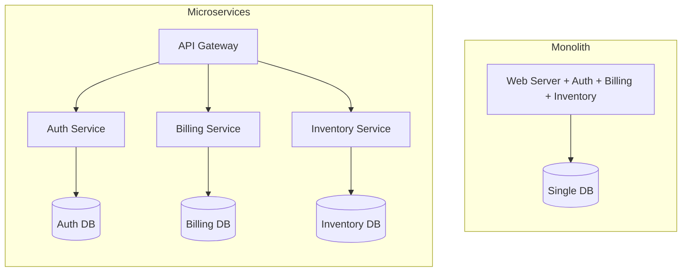
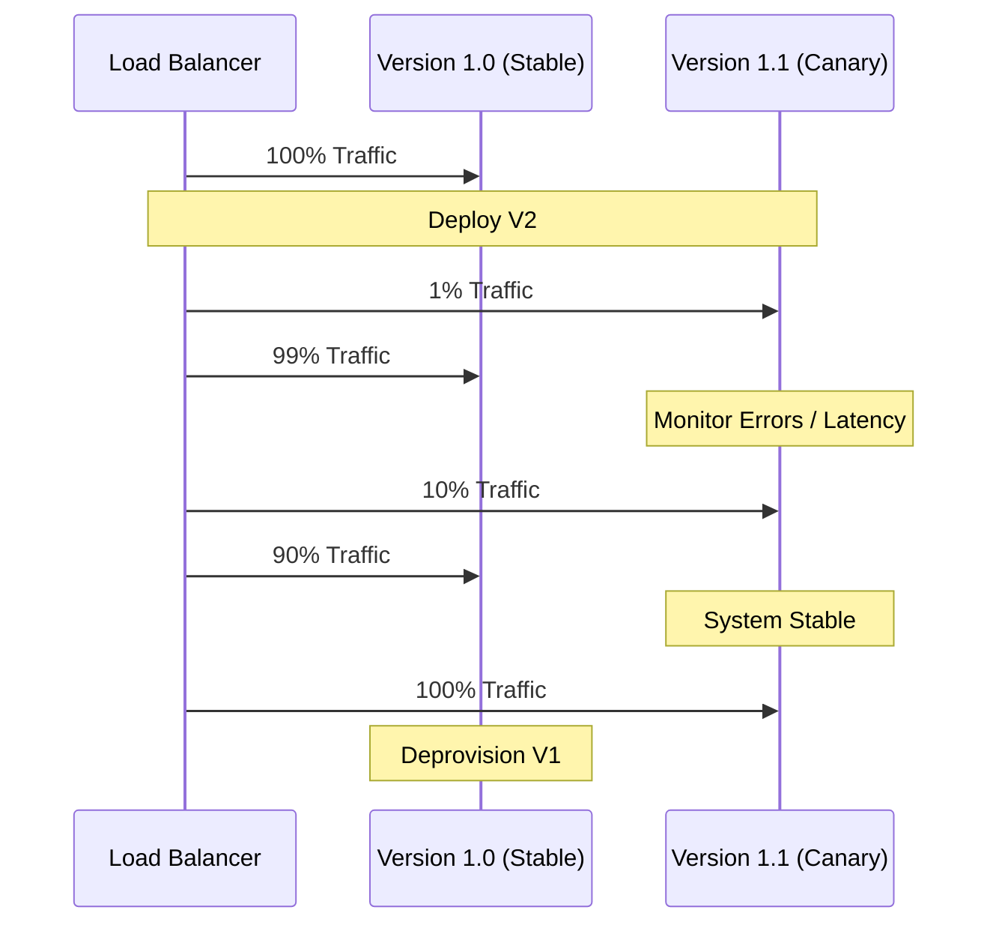
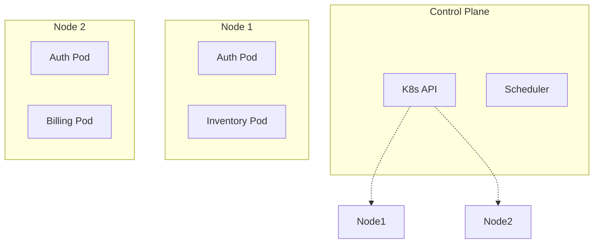
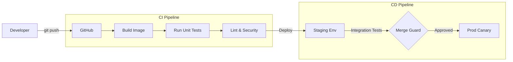
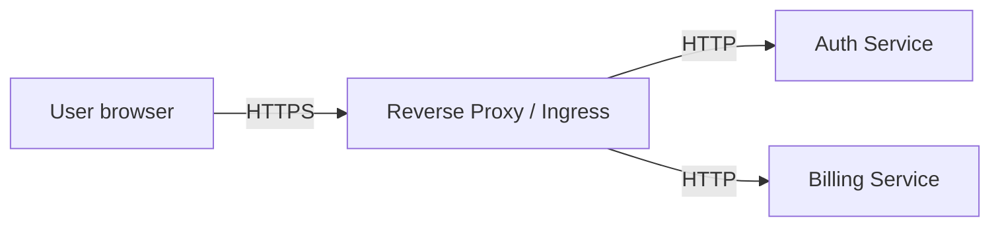
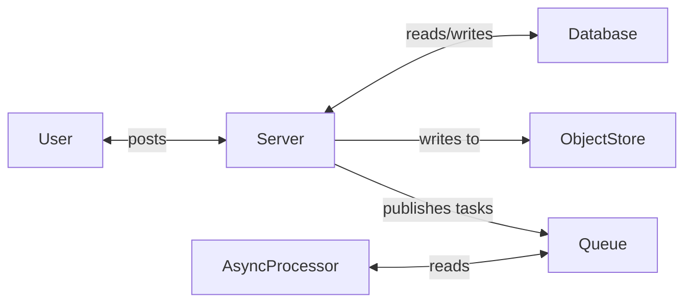

---
---
# Day 5 — Deployment, Delivery, and Architecture

---
layout: statement
---

You've fixed a critical bug locally. You commit the code. It's immediately deployed directly to 100% of production traffic.

**Everything seems fine on your machine. But users start reporting errors.**

How did it get there? How could you have prevented it? And how do you figure out what's broken?

<!-- Today is the final day. We've built up the pieces of the system — compute, data, communication — but a system isn't real until it's running in production. Today we cover how to ship code safely, how to keep it running, and what to do when it breaks. -->

---
layout: statement
---

# Monolith vs Microservices

How to divide your code before you deploy it.

---
---

# Monolith

A single deployable unit.

<v-clicks>

- **Structure:** All business logic, UI, and background workers are in one codebase and deployed as a single application.
- **Pros:** Simple to test locally, simple to deploy, no network latency between internal functions (Day 4 callback!).
- **Cons:** Any code change requires redeploying the whole system. A memory leak in the PDF generator takes down the checkout flow.
- **Scaling:** Scales by running multiple copies of the entire application.

</v-clicks>

<!-- Monoliths get a bad reputation, but they are almost always the correct choice for a new project. The communication complexity we talked about on Day 4? Monoliths don't have it. Functions just call functions in memory. -->

---
---

# Microservices

Many independent, deployable units.

<v-clicks>

- **Structure:** The system is split by business capability (e.g., Auth Service, Inventory Service, Billing Service).
- **Pros:** Teams can deploy independently. Services can be scaled independently (Day 2 vertical/horizontal scaling callback).
- **Cons:** Massive operational complexity. Services must now communicate over the network (RPC/REST/GraphQL). Network failures, idempotency, and retries become your daily problem (Day 4 callback).
- **Scaling:** Scales by running copies of specific services that need it.

</v-clicks>

<!-- Microservices solve organizational scaling (Conway's Law), not just technical scaling. When you have 500 engineers, they can't all safely commit to one monolith. But you trade software complexity for distributed systems complexity. -->

---
---

# The Architectural Divide

<!-- Notice the databases. In a true microservices architecture, services don't share databases. If Billing wants Auth data, it has to ask the Auth service. This prevents tight coupling but introduces data consistency challenges (Day 3 CAP theorem callback). -->

---
layout: statement
---

# Deployments

How do we actually give users the new code without breaking the system?

---
---

# Deployment Strategies

<v-clicks>

**Rolling Deployment:**
- Replace instances one by one (or in small batches).
- Reduces downtime, but old and new code run simultaneously (schema evolution is critical!).

**Blue-Green Deployment:**
- Stand up the entire new version (Green) alongside the old version (Blue).
- Switch the load balancer to point 100% of traffic to Green instantly. Easy rollback.

**Canary Deployment:**
- Route 1% of traffic to the new version.
- Monitor error rates. If safe, slowly dial up to 10%, 50%, 100%.

</v-clicks>

<!-- Deploying to 100% of users at once (the opening hook) is terrifying. Canary deployments are how large companies survive. You test in production, but only on a tiny fraction of users. -->

---
---

# Canary Deployment Flow

<!-- This is how you sleep at night. If V2 has a bug, only 1% of users see it, the monitoring alerts you, and you automatically route traffic back to V1. -->

---
layout: statement
---

# Containerization

Solving "it works on my machine" forever.

---
---

# Docker and Containers

<v-clicks>

**The Problem:** Your code depends on Node 18, specific environment variables, and Ubuntu. The production server has Node 14 and Debian.

**The Solution:** Package the code, the runtime, and the exact OS dependencies into a single immutable artifact: a **container image**.

- **Virtual Machines (VMs):** Emulate hardware. Each VM runs a full Operating System. Heavy, slow to boot.
- **Containers:** Share the host's OS kernel. They isolate processes, not hardware. Lightweight, boots in milliseconds.

</v-clicks>

<v-click>

If a container runs on your laptop, it will run exactly the same way in the cloud.

</v-click>

<!-- Containers changed the industry because they created a standard unit of deployment. Before Docker, companies had 20-page runbooks of bash commands to set up a server. Now, you just say `docker run image`. -->

---
layout: statement
---

# Orchestration & Kubernetes

What happens when you have 10,000 containers?

---
---

# Why Orchestration?

Running one container is easy (`docker run`). Running thousands is hard.

<v-clicks>

- Which physical machine should run this container?
- What if that machine's power supply dies?
- How do containers find each other over the network?
- How do we do a rolling deployment without downtime?

</v-clicks>

<v-click>

**Kubernetes (K8s)** is the operating system for the cloud. It manages clusters of machines and schedules containers onto them.

</v-click>

<!-- You don't tell Kubernetes "run this container on Server 4". You tell it "I want 5 copies of the Auth Service running." Kubernetes figures out where to put them and restarts them if they crash. -->

---
---

# Kubernetes Concepts

<v-clicks>

- **Pod:** The smallest deployable unit. Usually wraps a single container.
- **Node:** A physical or virtual machine in the cluster.
- **Deployment:** A declarative rule: "Keep 3 replicas of this Pod running."
- **Service:** A stable internal IP and load balancer for a group of Pods. (Pods are ephemeral; IPs change constantly. Services provide stability.)

</v-clicks>

<v-click>

</v-click>

<!-- Declarative infrastructure is the key here. You don't write scripts to manage K8s. You write YAML files describing the desired state, and K8s makes reality match the YAML. -->

---
layout: statement
---

# Cloud, IaC, and CI/CD

From code commit to running in production.

---
---

# Infrastructure as Code (IaC)

<v-clicks>

- **The Old Way:** Click around the AWS console to create servers, databases, and networks. (Impossible to review, prone to human error).
- **The New Way (IaC):** Define infrastructure in code (Terraform, AWS CDK, Pulumi).
- **Why?** 
  - Version controlled (git).
  - Reproducible (create a staging environment identical to prod in 5 minutes).
  - Reviewable (Code Review for infrastructure changes).

</v-clicks>

<!-- If you click a button in a UI to configure production, you're doing it wrong. Infrastructure should be reviewed and merged just like application code. -->

---
---

# CI/CD Pipelines

Continuous Integration / Continuous Deployment. The safety net.

<v-click>

You don't deploy to prod. You push code, and the **pipeline** deploys to prod — but only if all tests pass.

</v-click>

<!-- Remember Day 1 when we asked how we prevent bad changes from breaking the app? This is it. CI/CD is the automated enforcement of your engineering standards. -->

---
layout: statement
---

# Routing Traffic

How does a user's request actually get to your code?

---
---

# Serverless, Proxies, and Ingress

<v-clicks>

- **Serverless / Lambda:** (Day 2 callback) The cloud provider manages the orchestration entirely. You just provide the code. Triggered by HTTP or events.
- **Reverse Proxy:** (NGINX, HAProxy) Sits in front of your servers. Handles TLS (HTTPS) termination, rate limiting, and basic load balancing.
- **Ingress Controller:** The Kubernetes native way to route external HTTP traffic to internal K8s Services based on URL paths.

</v-clicks>

<v-click>

</v-click>

<!-- You almost never expose your application server (like Node or Python) directly to the internet. A reverse proxy is hardened for security, handles the heavy lifting of encryption, and routes traffic cleanly. -->

---
layout: statement
---

# Observability

"If you can't observe it, you can't debug it."

---
---

# The Three Pillars of Observability

When your microservices architecture breaks, how do you know what happened?

<v-clicks>

1. **Metrics:** Quantitative data. "CPU is at 90%", "Error rate is 5%", "Latency is 200ms." Tells you **that** there is a problem.
2. **Logs:** Immutable record of discrete events. `[ERROR] Failed to connect to DB`. Tells you **what** the problem is.
3. **Traces:** The lifecycle of a single request across multiple services. Tells you **where** the problem is.

</v-clicks>

<!-- In a monolith, you just tail a log file. In microservices, a single user click might hit 5 different services. If it's slow, whose fault is it? You need distributed tracing. -->

---
---

# Distributed Tracing

<v-clicks>

- Every request entering the system gets a unique `Trace-ID`.
- This ID is passed in HTTP headers to every downstream service (Day 4 communication callback).
- Every service logs its start/stop time (a `Span`) tied to that `Trace-ID`.
- Observability tools (Datadog, Jaeger) reconstruct the request as a waterfall.

</v-clicks>

<!-- Without this, debugging microservices is literally impossible. You're just guessing based on timestamps. With this, you can see exactly which service held up the line. -->

---
---

# Trace Waterfall Visualization

<TraceWaterfall />

<!-- Let's run a trace. Watch how the Gateway waits for Auth, then calls Payments, which in turn calls Stripe. The Gateway's total time is the sum of the longest path. If Stripe is slow, the user sees a slow Gateway. -->

---
layout: statement
---

# Auto Scaling

Matching compute to demand automatically.

---
---

# Elasticity in the Cloud

<v-clicks>

- **Scale Up (Horizontal):** Add more Pods/VMs when traffic spikes.
- **Scale Down:** Remove them when traffic drops (Saves money!).
- **Triggers:**
  - CPU / Memory utilization > 80%
  - Queue depth (Day 1 callback) — e.g., "if there are 10,000 images waiting to process, spin up 50 more worker nodes."
  - Custom business metrics.

</v-clicks>

<v-click>

This is the ultimate promise of the cloud. You don't buy servers for Black Friday and leave them idle the rest of the year. You scale to meet load, dynamically.

</v-click>

<!-- This ties back to Day 2's Compute. We use stateless services specifically so we can auto-scale horizontally. If your service had state in memory, you couldn't just spin up 10 new copies safely. -->

---
layout: statement
---

# Day 5 Recap

Architecture shapes deployment. CI/CD ensures safety. Orchestration manages scale. Observability enables survival.

---
layout: statement
---

# The Full Course Recap

From Day 1 to Day 5.

---
---

# The Journey

<v-clicks>

- **Day 1: The Components.** We learned what exists. Compute, Databases, Queues, Object Stores.
- **Day 2: Compute.** We learned how it runs. CPU-bound vs IO-bound, threads vs async event loops, horizontal vs vertical scaling.
- **Day 3: State.** We learned how data survives. OLTP vs OLAP, CAP theorem tradeoffs during partitions, B-trees vs LSM-trees, replication and sharding.
- **Day 4: Communication.** We learned how systems talk. Sync vs Async, RPC vs REST, schema evolution, and the absolute necessity of timeouts, retries, and idempotency.
- **Day 5: Delivery.** We learned how to ship it safely. Containers, Kubernetes, CI/CD, and Observability.

</v-clicks>

<!-- This is everything you've learned. You came in knowing how to write code. You're leaving knowing how code survives in the wild. -->

---
---

# The Day 1 Diagram, Re-imagined

Remember this from Monday?

<v-click>

You now know that:
- `Server` is a **containerized** app deployed via **CI/CD** running on **K8s**, scaled **horizontally**.
- `Database` is chosen based on **read/write patterns**, likely **replicated**, making deliberate **CAP tradeoffs**.
- The `Queue` enables **async communication** to provide backpressure.
- Every line represents a network call requiring **timeouts**, **retries**, and **idempotency**.

</v-click>

<!-- Every box and arrow in this diagram is no longer just a magical abstraction to you. You know what they do, why they fail, and how they scale. -->

---
layout: quote
---

"The goal was never to memorize these topics individually. The goal was to build the instinct to ask **'what happens at scale, under failure, under load?'** before you ever ship a line of code."

<v-clicks>

Thank you for your time this week. 

Whether you are a DMT intern or just joined because you were curious — you are now ready to engineer at scale.

</v-clicks>

<!-- Wrap it up here. Thank them for sticking through a dense 5 days. Remind them that software engineering is a team sport, and now they have the vocabulary to participate in the architecture discussions. -->
